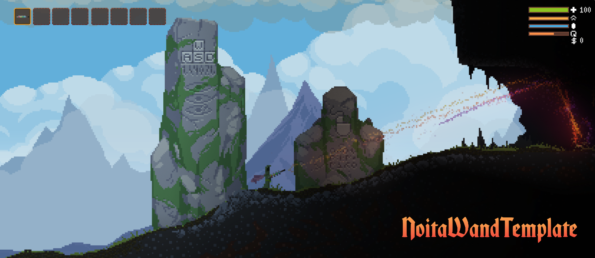

<h1 align="center">
    NoitaWandTemplate  
</h1>

<h1 align="center">
  <picture>
    <source srcset="assets/banner.png">
    
  </picture>
</h1>

  <h4>
    <a href="#about">About</a> |
    <a href="#requirements">Requirements</a> |
    <a href="#installation">Installation</a> |
    <a href="#usage">Usage</a> |
    <a href="#references">References</a> |
    <a href="#contributing">Contributing</a> |
    <a href="#license">License</a>
  </h4>

  Built by
  <a href="https://orel138.github.io">Orel138</a> and
  <a href="https://github.com/orel138/NoitaWandTemplate/graphs/contributors">contributors </a>

 

### :mage_man: A tutorial and template for creating custom wands in Noita.

## Table of Contents

- [About](#about)
- [Requirements](#requirements)
- [Installation](#installation)
- [Usage](#usage)
- [References](#references)
- [Contributing](#contributing)
- [License](#license)

## About

_NoitaWandTemplate_ is a project aimed at helping Noita modders create their own custom wands. It provides a basic template and tutorial that you can use as a starting point for your wand creation process.

<a href="#readme-top">~~~~~ back to top ~~~~~</a>

### Features

- Basic wand template ready for customization.
- [Tutorial](/docs/TUTORIAL.md) on how to create and modify wands in Noita.

<a href="#readme-top">~~~~~ back to top ~~~~~</a>

## Requirements

- All the tools you need to get started are:

1. A good text editor (e.g., VSCode, Notepad++, Sublime Text, Vim)
2. A reliable image editor (e.g., Aseprite, GIMP, Paint.net, Photoshop)

> [!TIP] 
> I recommend using VSCode and Aseprite, as that’s what I use, and they work perfectly! :slightly_smiling_face:

- First of all, if you want to create a mod for the game Noita, you’ll need to start by extracting the game’s data files by following the procedure outlined at this link: https://noita.fandom.com/wiki/Modding#Getting_Started

<a href="#readme-top">~~~~~ back to top ~~~~~</a>

## Installation

1. Clone this repository directly into your 'Noita/mods/' folder.
(the 'steamapps/workshop/content/881100/' folder is not recommended as it is intended for mods downloaded from the Steam Workshop).
2. You can edit the project's PNG, XML, and LUA files to customize wand values, graphics, and Lua script actions."

<a href="#readme-top">~~~~~ back to top ~~~~~</a>

## Usage

1. Study [the tutorial](/docs/TUTORIAL.md) to understand the wand creation process.
2. Use the provided template as a base for your custom wand.
3. Modify the scripts/graphics to achieve your desired wand behavior and appearance.

<a href="#readme-top">~~~~~ back to top ~~~~~</a>

## References

- The modding section of the Noita wiki, available here: https://noita.fandom.com/wiki/Modding

<a href="#readme-top">~~~~~ back to top ~~~~~</a>

## Contributing
We welcome your contributions to improve the tutorial or template.

To contribute:
1. Fork the repository.
2. Create a new branch: git checkout -b [branch-name].
3. Make your changes and commit them: git commit -m '[commit-message]'.
4. Push to the original branch: git push origin [project-name]/[location].
5. Create the pull request.

<a href="#readme-top">~~~~~ back to top ~~~~~</a>

## License

The tutorial text in this project is released under the [MIT license](/LICENSE) © [Orel138](https://github.com/Orel138).

**Note:** The wand code itself is taken directly from the game files and is not covered under this license.
All rights for the game code belong to the original creators of Noita.

<a href="#readme-top">~~~~~ back to top ~~~~~</a>

## Disclaimer

- This project is a fan-made tool and is not officially associated with or endorsed by © [Nolla Games](https://nollagames.com/), the creators of Noita.
- The fonts "Noita Blackletter" used in images were created by the Reddit user Viowlet. You can download them via this Reddit link: https://www.reddit.com/r/noita/comments/jp56ub/a_while_ago_i_made_noita_blackletter_this_is_now/

<a href="#readme-top">~~~~~ back to top ~~~~~</a>

> [!TIP]
> I trust you'll find this project enjoyable. Should you appreciate the project, bestowing a small ⭐ on it is a meaningful gesture, signifying: **My efforts are recognized.** Your support would be greatly valued. _Many thanks!_
